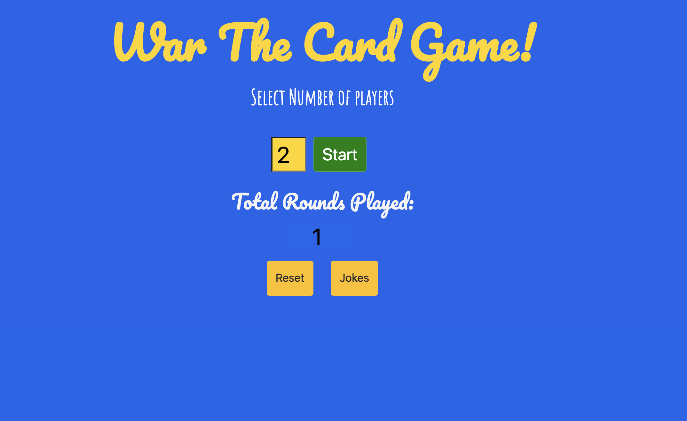
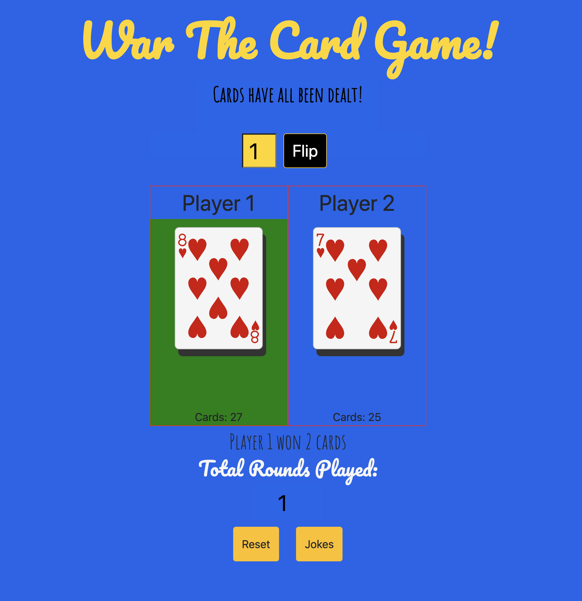
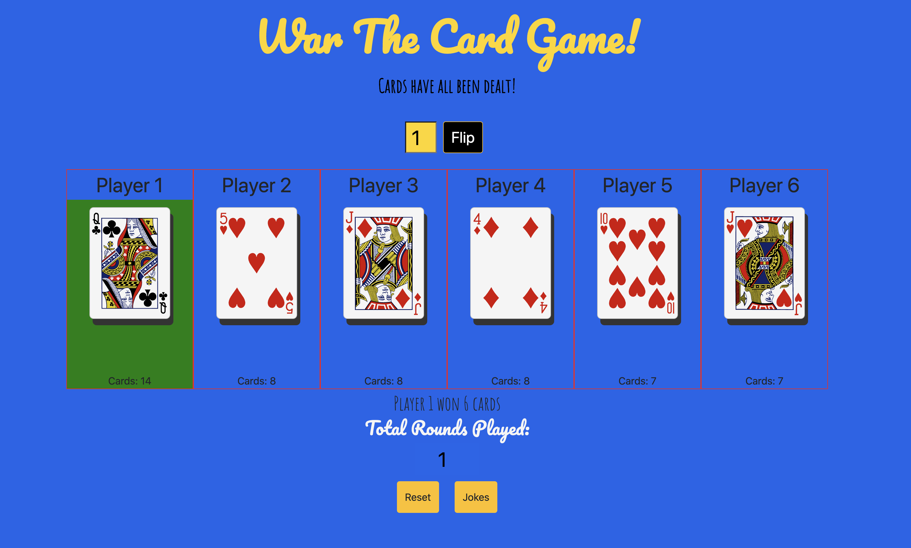

# War The Card Game
[You can play the game here!](http://warthecardgame.surge.sh/)
## Game Logic 
#### The user can pick how many players are in each game
#### A deck of cards is shuffled, and then split between the number of players selected
#### the players each flip over a card, the player with the highest number wins that round
#### in the event of a tie, then it is war, each player places 3 cards facedown, an flips the fourth card to be compared. The player with the highest card then wins the war. 
#### the same mechanisms go on until one player has all the cards, the player with all of the cards is the winner 

.png)

### Screenshots of Gameplay

### Technologies Used 
* CSS
* JavaScript 
* HTML
* Bootstrap
* Whimsical (for wire frames)
* Postman
* Random Joke API

### Future Improvements
1. Add more decks of cards if there are more players.
2. Add an empty deck of cards for each player to flip from.
3. Add more animations.
4. Make buttons better looking.
