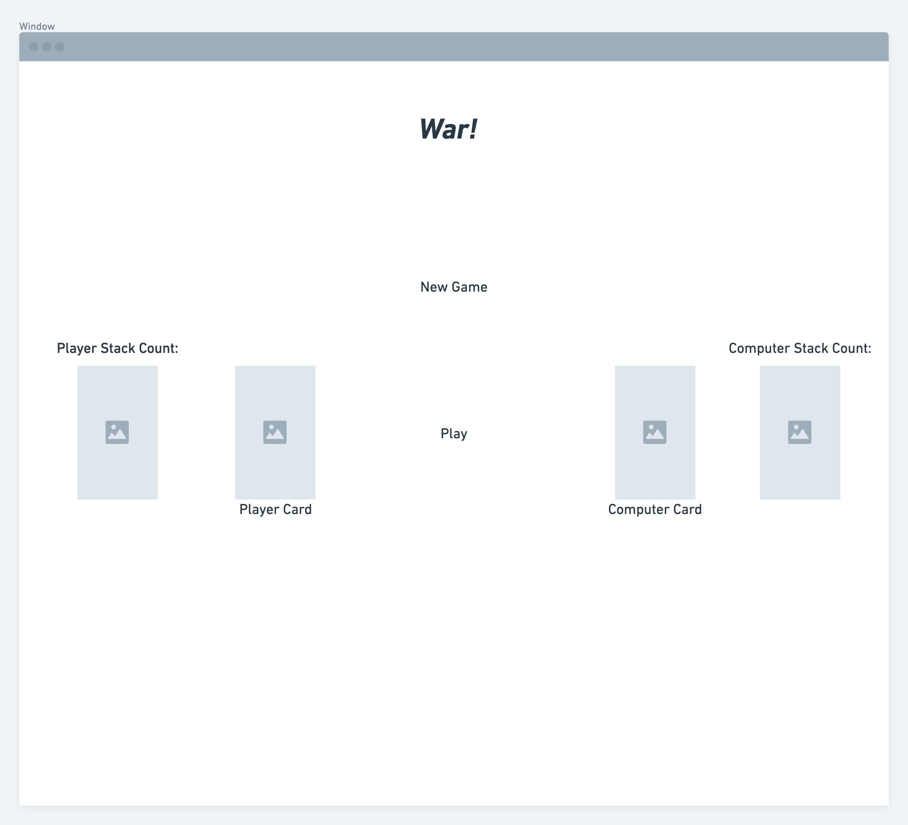

# warTheCardGame
# Game Logic 
## A deck of cards is shuffled, and then split between the 2 players
## the players each flip over a card, the player with the highest number wins that round
## in the event of a tie, then it is war, each player places 3 cards facedown, an flips the fourth card to be compared. The player with the highest card then wins the war. 
## the same mechanisms go on until one player has all the cards, the player with all of the cards is the winner 
